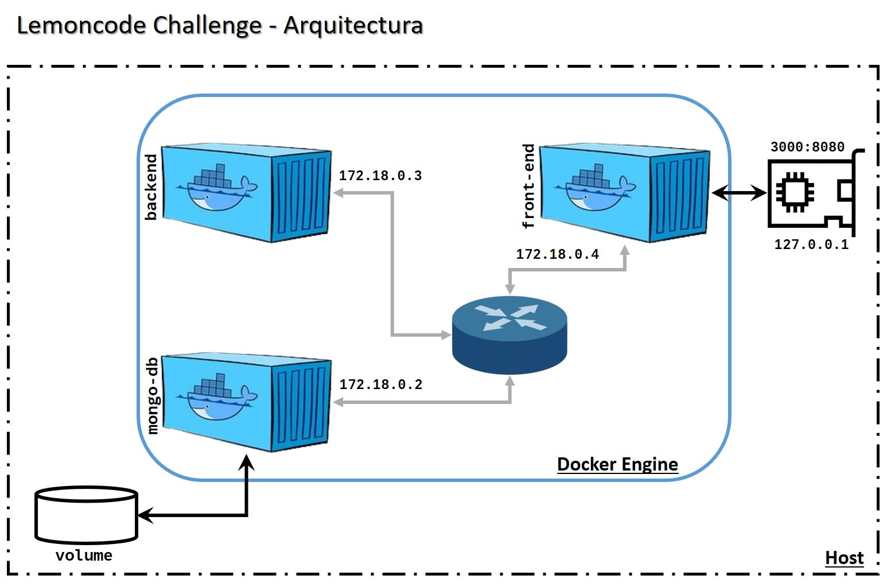

# Modulo 2 - Laboratorio Contenedores Docker

## General:

El laboratorio tiene como objetivo **_dockerizar_** una aplicacion de tres niveles o componentes:

- Frontend
- Backend
- Base de datos

**Para el desarrollo del laboratorio se utiliza el siguiente stack: `NodeJs` para frontend y backend, `MongoDB` para la base de datos**

## Requisitos:

- Cada uno de los componentes, debe ser contenerizado.
- Los tres componentes deben estar en una red llamada: `lemoncode-challenge`
- El backend debe comunicarse con la base de datos a traves del siguiente URL: `mongodb://some-mongo:27017`
- El fronend debe comunicarse con el backed a traves del siguiente endpoint: `http://topics-api:5000/api/topics`
- El frontend debe ser expuesto al host a traves del puerto: `8080`
- La base de datos debe almacenar la informacion a un volumen mapeado internamente a: `/data/db`
- La base de datos debe ser llamana `TopicstoreDb`, con una coleccion llamada: `Topics`
- La coleccion **Topics** debe tener la siguiente estructura:

```bash
    {
    "_id": { "$oid" : "5fa2ca6abe7a379ec4234883" },
    "topicName" : "Contenedores"
    }
```

## `Aruitectura de la Aplicacion`

En el siguiente esquematico, se esboza la aplicacion con cada uno de los componentes y su interaccion.



## `Paso #01`

Como se sugiere en el laboratorio, se comienza probando de forma local la aplicacion de backend.

- _"**Tip para backend:** Antes de intentar contenerizar y llevar a cabo todos los pasos del ejercicio se recomienda
  intentar ejecutar la aplicación sin hacer cambios en ella. En este caso, lo único que es posible que no tengamos
  a mano es el Mongodb . . ."_

Se reviso la [documentacion oficial de mongo](https://hub.docker.com/_/mongo) en docker hub, para levantar un contenedor con mongo. A continuacion se citan las referencias de dicha documentacion.

### _Environment Variables_

_When you start the mongo image, you can adjust the initialization of the MongoDB instance by passing one or more environment variables on the docker run command line. Do note that none of the variables below will have any effect if you start the container with a data directory that already contains a database: any pre-existing database will always be left untouched on container startup._

```bash
$ docker run -d -p 27017:27017 --name some-mongo \
	-e MONGO_INITDB_ROOT_USERNAME=admin \
	-e MONGO_INITDB_ROOT_PASSWORD=secret \
	mongo
```

Dentro de la carpeta `backend` se instalaron las dependencias y se corrio la aplicacion utilizando el script `npm start`.

```bash
    odan@odan-vm-ubuntu:~/Lemon-code/02-docker/node-stack/backend$ npm start

    > workspace@1.0.0 start
    > ts-node src/app

    Server listening on http://localhost:5000
```

Para crear datos dentro de la coleccion `Topics`, se utilizo `curl` como se sugiere en el **_README.md_** del backend.

```bash
curl -d '{"Name":"Devops"}' -H "Content-Type: application/json" -X POST http://localhost:5000/api/topics
curl -d '{"Name":"K8s"}' -H "Content-Type: application/json" -X POST http://localhost:5000/api/topics
curl -d '{"Name":"Docker"}' -H "Content-Type: application/json" -X POST http://localhost:5000/api/topics
curl -d '{"Name":"Prometheus"}' -H "Content-Type: application/json" -X POST http://localhost:5000/api/topics
```

A continuacion se muestra una captura de pantalla, mostrando los documentos creados con `curl`


## `Paso #02`

Se crea el volumen y la red, ambos a ser gestionados por el **docker engine**.

```bash
    docker volume create vol-mongo
    docker network create lemoncode-challenge
```

## `Paso #03`

Se crea un _Dockerfile_ para crear la imagen del componente **backend**.

- Ir a carpeta `backend` y crear dos ficheros:
  - Dockerfile
  - .dockerignore
- Dentro de `.dockerignore` listar todos los ficheros y/o carpetas que no deban ser copiadas a la imagen
- Dentro de `Dockerfile` crear el manifiesto de la imagen de nuestra aplicacion.  
  **_NB: La aplicacion usa Typescript, por lo que se requiere utilizar un "transpiler", asi que se recomienda crear la imagen en multi-stage_**

```Dockerfile
    # builder image
    FROM node:18 AS builder

    WORKDIR /opt/build

    COPY . .
    # Instalar dependencias
    RUN npm ci
    # Transpilar y construir distribucion
    RUN npm run build

    # production image
    FROM node:18.20.4-alpine

    RUN mkdir -p /opt/node/app && chown -R node:node /opt/node/app

    WORKDIR /opt/node/app

    # Copiar dependencias
    COPY ./*.json .

    USER node

    # Instalar dependencias
    RUN npm ci --only-production

    # Copiar codigo
    COPY --from=builder --chown=node:node /opt/build/dist .

    EXPOSE 5000

    CMD ["node","app.js"]
```

Una vez que se tenga el manifiesto, se construye la imagen en el registry local.

```bash
    docker build . -t node-backend:1.0.0
```

## `Paso #04`

Se crea un _Dockerfile_ para crear la imagen del componente **front-end**.

- Ir a carpeta `frontend` y crear dos ficheros:
  - Dockerfile
  - .dockerignore
- Dentro de `.dockerignore` listar todos los ficheros y/o carpetas que no deban ser copiadas a la imagen
- Dentro de `Dockerfile` crear el manifiesto de la imagen de nuestra aplicacion.

```Dockerfile
    # production image
    FROM node:18.20.4-alpine

    RUN mkdir -p /opt/node/app && chown -R node:node /opt/node/app

    WORKDIR /opt/node/app

    USER node

    COPY --chown=node:node . .

    # Instalar dependencias
    RUN npm ci

    EXPOSE 3000

    CMD ["node","server.js"]
```

Una vez que se tenga el manifiesto, se construye la imagen en el registry local.

```bash
    docker build . -t node-front:1.0.0
```

## `Corriendo la Aplicacion`

Para simplificar la ejecucion de toda la aplicacion, asi como, mantener un orden en la ejecucion de los contenedores para cumplir con la dependencia entre componentes. Se creo un **bash script** para dicho proposito:

**_Referencia: launch-app.sh_**

```bash
    #!/bin/bash
    VOL=vol-mongo
    NET=lemoncode-challenge
    CNX="mongodb://some-mongo:27017"
    API="http://topics-api:5000/api/topics"

    # 01: Ejecucion de mongo
    docker run -d --name some-mongo \
    --mount source=$VOL,target=/data/db \
    --network $NET \
    mongo
    #-e MONGO_INITDB_DATABASE=TopicstoreDb \
    #-e MONGO_INITDB_ROOT_USERNAME=admin \
    #-e MONGO_INITDB_ROOT_PASSWORD=secret \
    #mongo

    # Tiempo de espera para permitir se levante el servicio
    sleep 0.1

    # 02: Ejecucion de backend
    #docker run -d --name backend -p 5000:5000 \
    docker run -d --name topics-api \
    --network $NET \
    -e DATABASE_URL=$CNX \
    node-backend:1.0.0

    # Tiempo de espera para permitir se levante el servicio
    sleep 3

    # 03: Ejecucion de front-end
    docker run -d --name frontend -p 8080:3000 \
    --network $NET \
    -e API_URI=$API \
    node-front:1.0.0

    # Tiempo de espera para permitir se levante el servicio
    sleep 1

    # Fin de ejecucion de script
    echo Aplicacion corriendo . . .
    docker ps
```


## `Verificacion del despliegue`

Para verificar que la aplicacion se haya levantado de forma correcta, se abrio un navegador y se hizo una llamada desde el host a la URL:`http://localhost:8080`, obteniendose la siguiente respuesta:


Durante los pasos anteriores para contenerizar la aplicacion, se guardaron datos dentro del `mongo-db`. Por lo que se sabe de antemano existen datos para ser mostrados en el navegador. Se tomo la decision de modificar el codigo del servidor del front-end para descartar que no habia un problema con el despliegue, tal como problemas de conexion entre el front-end, backend y la base de datos.

En el codigo del servidor de front-end (`/frontend/server.js`) se agrego una linea de codigo para desplegar en consola la respuesta del backend a traves de su api, tal y como se muestra a continuacion:


Hecha la modificacion se recreo la imagen de front-end y se corrio la aplicacion nuevamente. Desde la terminal del host, se hizo una llamada al servidor de front-end utilizando `curl` y se verifico la respuesta con el uso de los **logs** del contenedor, verificandose que la llamada si retorna los topicos guardados en la base de datos. Concluyendo asi, que es el template de la aplicacion del front-end la que tiene un problema en el despliegue de la informacion.


## `Orquestacion de la Aplicacion`

Como extension y mejora en el despliegue de la aplicacion, se utilizara `docker compose` como orquestador de los contenedores que componen la aplicacion. Docker compose es facil de usar y permite gran flexibilidad en como queremos arrancar y parar nuestra aplicacion. A continuacion se listan los [comandos basicos de docker compose](https://stackoverflow.com/questions/46428420/docker-compose-up-down-stop-start-difference) necesarios para dichas operaciones:

- **docker-compose up** _Se encarga de crear y arrancar todos los servicios definidos en el manifiesto `docker-compose.yaml`._
- **docker-compose down** _Detiene y remueve todos los contenedores, asi como las redes que fueron creadas para comunicar a los contenedores._
- **docker-compose start** _Arranca unicamente los contenedores previamente creados._
- **docker-compose stop** _Detiene unicamente los contenedores sin removerlos._

Sin lugar a dudas, el comando mas importante es `docker-compose up` debido a que es quien utiliza el manifiesto (**_docker-compose.yaml_**) para levantar nuestra aplicacion. En el siguiente articulo _**["Everything You Need to Know About the docker-compose up Command in Docker"](https://dev.to/kailashnirmal/everything-you-need-to-know-about-thedocker-compose-upcommand-in-docker-5cf2)**_, se explica ampliamente el uso de este comando.

## `Paso 01`

Se crea el manifiesto para la aplicacion en la carpeta del proyecto. Para el caso, el manifiesto se coloco en `/lemoncode-challenge` junto a los ficheros de la aplicacion.

## `Paso 02`

Se edito el manifiesto declarando todos los servicios requeridos, incluidos los volumenes y las redes.

**_NB: Para el caso de los componentes de la aplicacion, se utilizaron las imagenes previamente creadas._**

```bash
    services:
    some-mongo:
        image: mongo
        volumes:
        - vol-mongo:/data/db
        networks:
        - lemoncode-challenge

    topics-api:
        image: node-backend:1.0.0
        networks:
        - lemoncode-challenge
        environment:
        - DATABASE_URL=mongodb://some-mongo:27017

    frontend:
        image: node-front:1.0.0
        networks:
        - lemoncode-challenge
        ports:
        - 8080:3000
        environment:
        - API_URI=http://topics-api:5000/api/topics

    volumes:
    vol-mongo:

    networks:
    lemoncode-challenge:
```

## `Arranque y Parada de la Aplicacion`

Una vez que se ha creado el manifiesto, se corrio la aplicacion con el siguiente comando:

```bash
    docker compose up --detach
```

Y para detener la aplicacion, limpiando por completo el ambiente local se ejecuto el siguiente commando:

```bash
    docker compose down --volumes
```
